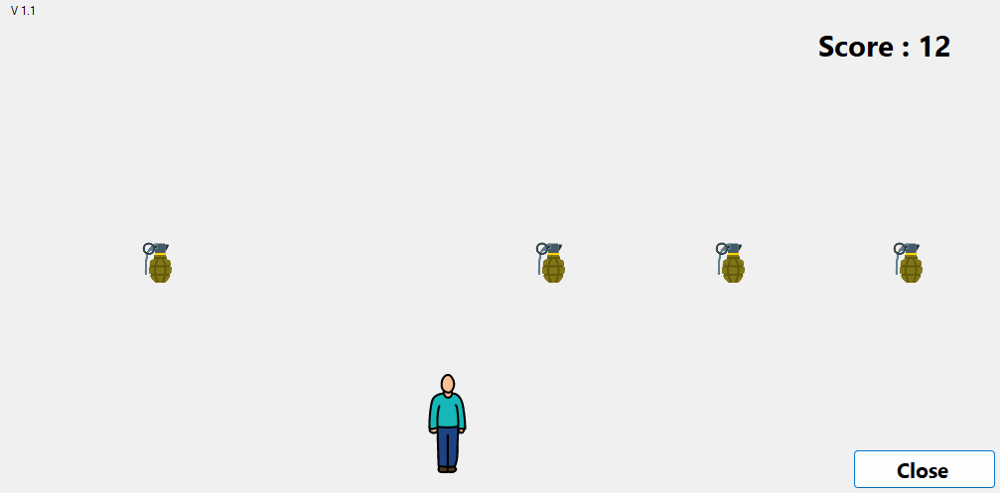
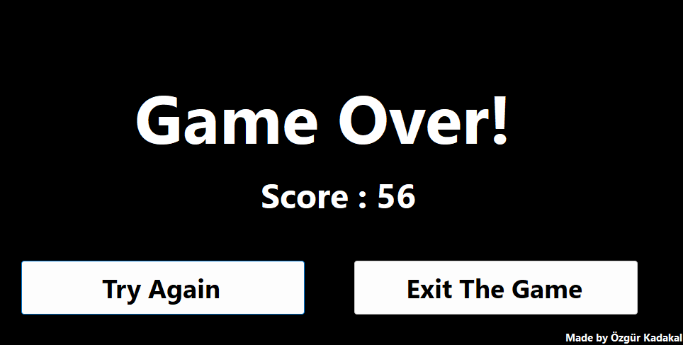

# 💣 Bomb Dodge Game | Bomba Kaçış Oyunu 🎮

### - Developed by Özgür Kadakal

**⚠️ Önemli:** İndirdiğiniz `.zip` dosyasını ayıklayıp projeyi bu şekilde açınız. Aksi takdirde proje düzgün şekilde çalışmayabilir.

**⚠️ Important:** Please extract the downloaded `.zip` file before opening the project. Otherwise, it may not work properly.

---

## 🖼️ Gameplay Previews

### 🎮 In-Game Screenshot 1

### 🎮 In-Game Screenshot 2

---

## 🌍 English

**Bomb Dodge** is a simple Windows Forms game developed in **C#** by *Özgür Kadakal*.  
🎯 The goal of the game is to control the character and dodge bombs falling from above.  
💥 If a bomb hits the character, the game ends.

### ✨ Features

- ⌨️ Player movement via keyboard (A-D keys)  
- 🎲 Randomized bomb drops  
- 📦 Collision detection system  
- 🚫 Game Over screen on hit

🧑‍💻 *This project was developed from scratch by Özgür Kadakal.*  
📌 *All code and assets are original.*

---

## 🇹🇷 Türkçe

**Bomba Kaçış**, *Özgür Kadakal* tarafından **C# ve Windows Forms** kullanılarak geliştirilmiş basit bir oyundur.  
🎯 Oyundaki amacınız, karakterinizi kontrol ederek üstünüze düşen bombalardan kaçmaktır.  
💥 Bir bomba size çarptığında oyun sona erer.

### ✨ Özellikler

- ⌨️ Klavye (A-D tuşları) ile karakter kontrolü  
- 🎲 Rastgele bomba düşmesi  
- 📦 Çarpışma algılama sistemi  
- 🚫 "Game Over" ekranı

🧑‍💻 *Bu proje Özgür Kadakal tarafından sıfırdan geliştirilmiştir.*  
📌 *Tüm kodlar ve içerikler özgündür.*

---

## 📬 Contact | İletişim

For any feedback, questions, or suggestions, feel free to contact me:  
📧 **ozgurkadakal61@gmail.com**

---

